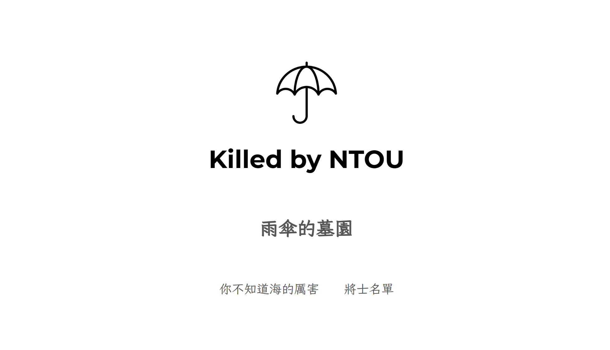

# Killed By NTOU

[English version](README.en.md)

飛翔受全體雨傘軍團之付託，依據宇宙射線之神造成之乖乖傳說，為紀念雨傘先烈，祭祀雨神，奠定雨中安全，增進校園安寧，設立此紀念版，頒行全球，永矢弗諼。

## 這是什麼？

這個專案是以純 HTML、CSS 與 JavaScript 製作的前端網站。內容會從 `list.json` 讀取，並顯示在首頁與名單頁面。

## 頁面

- `index.html` - 進入網站的切入點，顯示雨傘墓園主頁
- `list.html` - 雨傘完整名單
- `ocean.html` - 內嵌影片的主題頁面

## 資料

雨傘資料放在 `list.json` 的 `umbrella` 陣列中，每一筆資料目前包含：

- `index`
- `name`
- `from`
- `join-date`
- `died-date`
- `died-reason`
- `contribution`
- `hurt`

`script.js` 會讀取這些資料並產生頁面上的卡片內容。

## 資源

- `assets/umbrella/` - 以編號命名的單把雨傘照片

## 本機開啟

`index.html` 為網站靜態切入點。

## 授權

本專案採用 MIT License。詳見 [LICENSE](LICENSE)。
